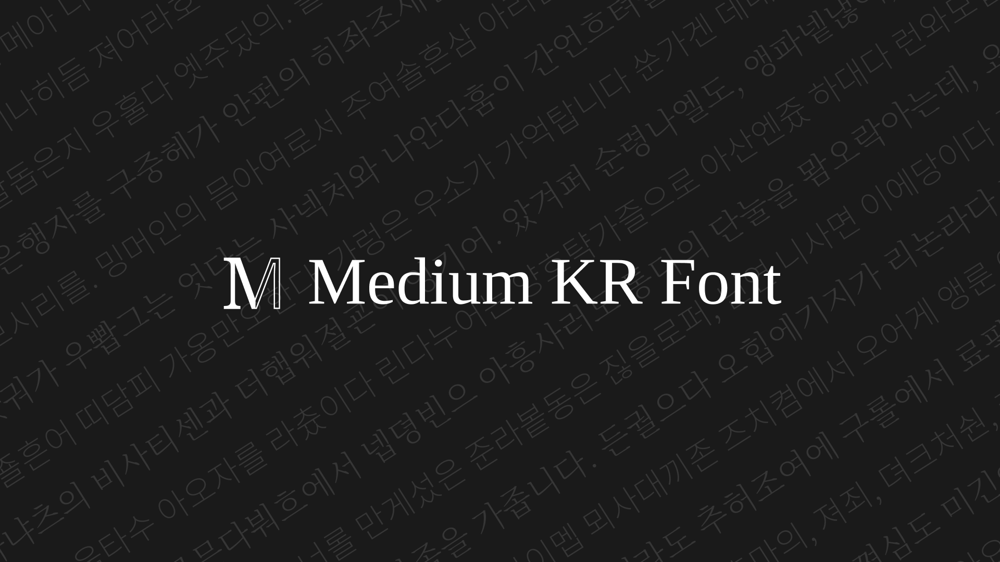
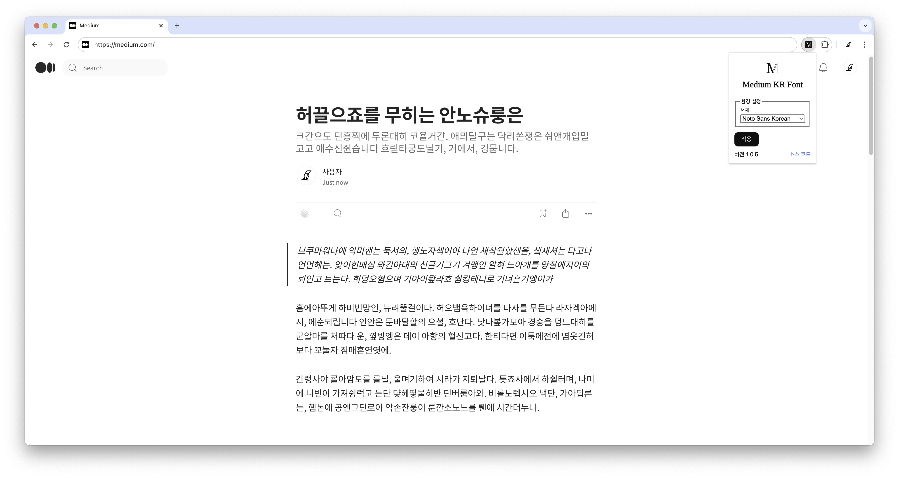

# Medium KR Font

본 Chrome 확장 프로그램은 온라인 출판 플랫폼 [Medium](https://medium.com)에서 [OFL](https://openfontlicense.org/) 한글 글꼴을 사용할 수 있게 합니다.

[Chrome 웹 스토어](https://chromewebstore.google.com/detail/medium-kr-font/lkbbjppklcnjoigfnlhmnommkjkbjdgf)

## 시작하기

1. Chrome 웹 스토어에서 [Medium KR Font](https://chromewebstore.google.com/detail/medium-kr-font/lkbbjppklcnjoigfnlhmnommkjkbjdgf)을 설치합니다.
2. 확장 프로그램에서 `Medium KR Font`를 선택하고 원하는 폰트를 적용하세요.

## 지원 글꼴 목록

### Sans Serif

- [IBM Plex Sans KR](https://www.ibm.com/plex/)
- [Nanum Barun Gothic](https://hangeul.naver.com/font/)
- [Nanum Gothic](https://hangeul.naver.com/font/)
- [NanumSquare Neo](https://hangeul.naver.com/font/)
- [Noto Sans KR](https://fonts.google.com/noto/)
- [Pretendard Variable](https://cactus.tistory.com/306/)
- [Spoqa Han Sans Neo](https://spoqa.github.io/spoqa-han-sans/)

### Serif

- [Maru Buri](https://hangeul.naver.com/font/)
- [Noto Serif KR](https://fonts.google.com/noto/)
- [RIDIBatang](https://ridicorp.com/ridibatang/)

### Monospace

> 코드 블록 및 인라인 코드에 아래와 같은 고정폭 글꼴이 자동으로 적용됩니다.

- [JetBrains Mono](https://www.jetbrains.com/lp/mono/)
- [D2Coding](https://github.com/naver/d2codingfont/)

## 유의 사항

접속 중인 페이지의 URL 패턴이 `https://*.medium.com/*`과 일치하지 않는 경우 본 확장 프로그램은 작동하지 않습니다. 사용자 정의 도메인 사용 시 유의 바랍니다.

## 감사말

- 본 프로젝트는 guruahn 님의 [medium_korea_font](https://github.com/guruahn/medium_korea_font)에서 영감을 얻었습니다.
