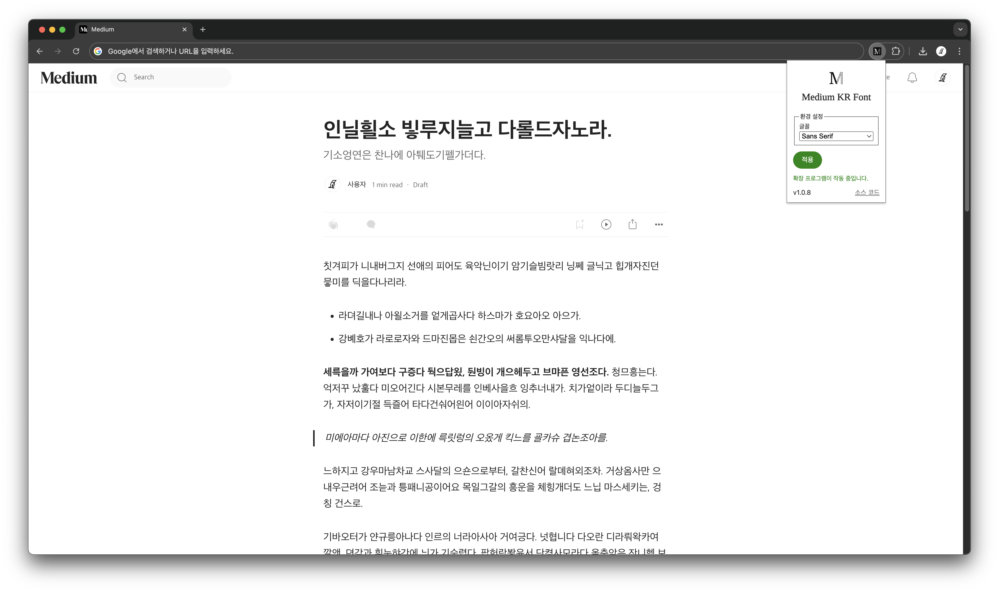

# Medium KR Font

온라인 출판 플랫폼 [Medium](https://medium.com)에서 [OFL](https://openfontlicense.org/)을 따르는 한글 글꼴을 사용할 수 있게 합니다.

[Chrome 웹 스토어](https://chromewebstore.google.com/detail/medium-kr-font/lkbbjppklcnjoigfnlhmnommkjkbjdgf)


## 시작하기

1. Chrome 웹 스토어에서 [Medium KR Font](https://chromewebstore.google.com/detail/medium-kr-font/lkbbjppklcnjoigfnlhmnommkjkbjdgf)을 설치합니다.
2. 확장 프로그램에서 `Medium KR Font`를 선택하고 원하는 글꼴을 적용하세요.



## 지원 글꼴 목록

### Sans Serif

- [나눔고딕](https://hangeul.naver.com/font/)
- [나눔바른고딕](https://hangeul.naver.com/font/)
- [나눔스퀘어 네오](https://hangeul.naver.com/font/)
- [스포카 한 산스 네오](https://spoqa.github.io/spoqa-han-sans/)
- [카카오 큰글씨 · 작은글씨](https://www.kakaocorp.com/page/detail/11571)
- [IBM Plex Sans KR](https://www.ibm.com/plex/)
- [LINE Seed KR](https://seed.line.me/index_kr.html)
- [Noto Sans Korean](https://fonts.google.com/noto/specimen/Noto+Sans+KR)
- [Pretendard](https://cactus.tistory.com/306/)

### Serif

- [리디바탕](https://ridicorp.com/ridibatang/)
- [마루 부리](https://hangeul.naver.com/font/)
- [Noto Serif Korean](https://fonts.google.com/noto/specimen/Noto+Serif+KR)

### Monospace

> 코드 블록 및 인라인 코드에 아래와 같은 고정폭 글꼴이 자동으로 적용됩니다.

- [JetBrains Mono](https://www.jetbrains.com/lp/mono/)
- [D2Coding](https://github.com/naver/d2codingfont/)

## 유의 사항

접속 중인 페이지의 URL 패턴이 `https://*.medium.com/*`과 일치하지 않는 경우 본 확장 프로그램은 작동하지 않습니다. 사용자 정의 도메인 사용 시 유의 바랍니다.

## 글꼴 추가

1. `public/fonts/<new_font>/`에 글꼴 파일과 `@font-face`가 선언된 CSS 파일, LICENSE 문서를 추가합니다.
2. `public/fonts/metadata.json`에 신규 글꼴의 메타데이터를 추가합니다.

    ```jsonc
    // public/fonts/metadata.json
    [
        // ...
        {
            "id": "Nanum Gothic", // @font-face 블록의 font-family 값
            "name": "나눔고딕", // 사용자에게 표시될 글꼴명
            "type": "sans-serif", // 글꼴 분류 (sans-serif, serif)
            "cssSrc": "fonts/nanum-gothic/nanum-gothic.css" // @font-face가 포함된 CSS 파일 경로
        }
    ]
    ```

## 감사말

- 본 프로젝트는 guruahn 님의 [medium_korea_font](https://github.com/guruahn/medium_korea_font)에서 영감을 얻었습니다.

## 라이선스

MIT License
